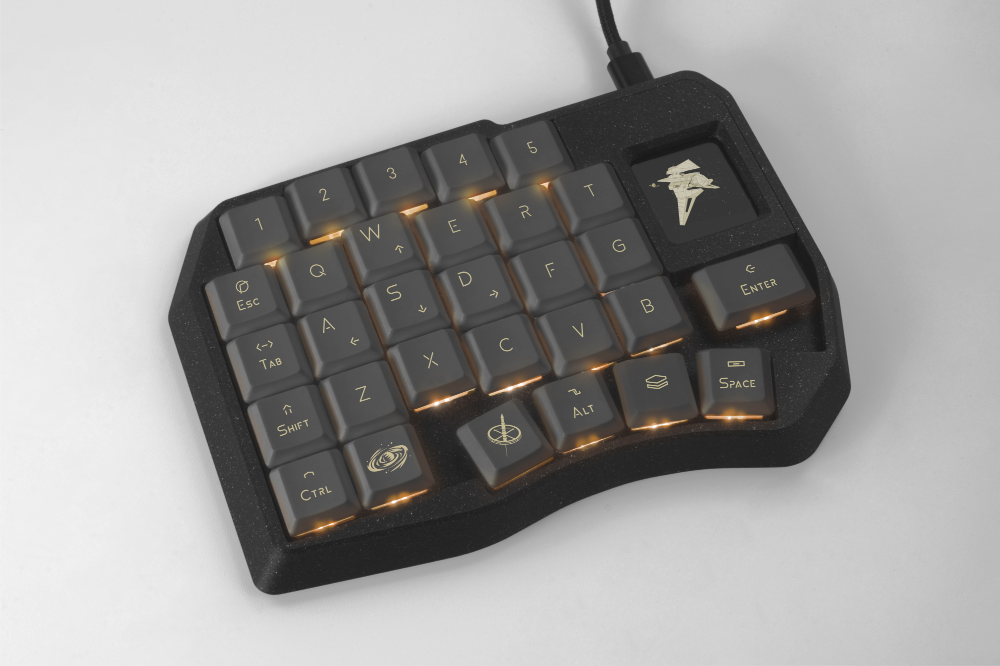
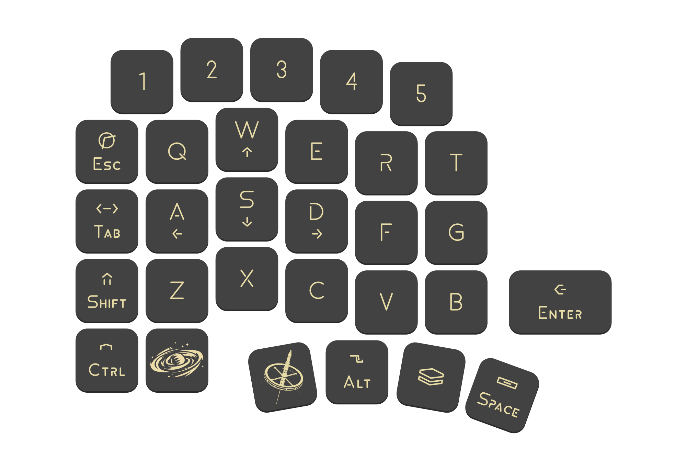
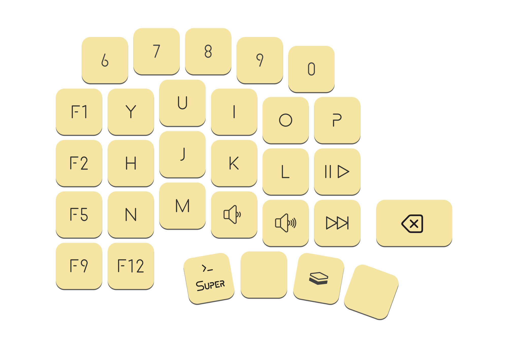

## Space Mission 30 is a mechanical gaming keypad designed for maximum comfort and flawless victories

*Its well‑thought‑out key layout and extensive customization options make it your main tool in any game*

## Design philosophy

Like a starship traveling faster than light through endless universes, it has only one mission — victory. A victory of human skill over the unknown, uniting engineering and creativity in a perfect instrument for achieving your goals

## Features

- Powered by RP2040 and QMK firmware
- Hotswap sockets, use your favorite MX based switches without any soldering, just plug and play - it's that simple!
- Color IPS display showing the key layout, active layer name, and a spaceship animation
- 30 programmable mechanical keys that keep your hand in a natural position while gaming
- The ability to install a hotspot encoder for volume control, navigation or other functions
- Per‑key customizable RGB backlight
- Easily remap any key and customize your keyboard with [Vial](https://eh.industries/vial)

## This repository contains all files related to this keyboard
PCB and schematic for [Space Mission 30](https://oshwlab.com/yuriiq/project_wokrdkjr)

### BOM

| Components | Quantity (pcs) |
| --- | ---: |
| Space Mission 30 PCB | 1 |
| RP2040 MCU, LQFN-56 | 1 |
| 1.69" LCD IPS, ST7789, 240x280, with SPI Interface | 1 |
| MX hotswap sockets | 30 |
| 1N4148W diodes, SOD-523F | 30 |
| Resistor 0402 5.1 kΩ | 4 |
| Resistor 0402 1 kΩ | 1 |
| Resistor 0402 200 Ω | 1 |
| Resistor 0402 27 Ω | 2 |
| Capacitor 0402 1 nF | 2 |
| Capacitor 0402 15 pF | 2 |
| Capacitor 0402 100 nF | 5 |
| Capacitor 0402 2.2 µF | 1 |
| SMD LED SK6803MINI-E-001 | 30 |
| P-channel MOSFET, SOT-23-3, SI2301-A1SHB | 1 |
| SMD tactile switch TS5235A 250gf 025 | 2 |
| LDO, SOT-23-3, 662K | 1 |
| SPI flash W25Q32JVSSIQ | 1 |
| SMD USB connector USB-TYPE-C-018 | 1 |
| SMD crystal resonator 12 MHz XXHCCLNANF-12.000000MHZ | 1 |
| 3M bumpons (8 mm) | 4 |
| MagSafe ring (optional) | 1 |

## License
The files in this repository are licensed under the Creative Commons Attribution-NonCommercial-ShareAlike 4.0 International License

## Useful links

- [Case for 3D printing (STL)](stls)
- [Case model for editing (STEP)](step)
- [Circuit schematic](https://oshwlab.com/yuriiq/project_wokrdkjr)

### Firmware
- [Pre-compiled files](https://github.com/ergohaven/keymap_hub)
- [QMK Source code](https://github.com/ergohaven/vial-qmk)

## Availability
The complete keyboard (not a DIY kit) is available for purchase at [eh.industries](https://eh.industries/)
